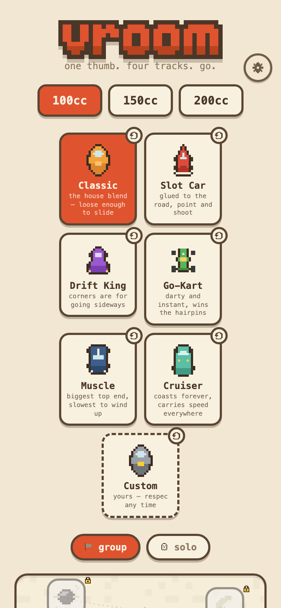
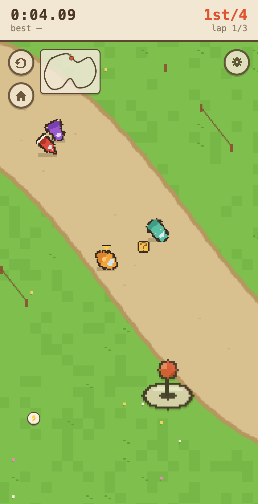
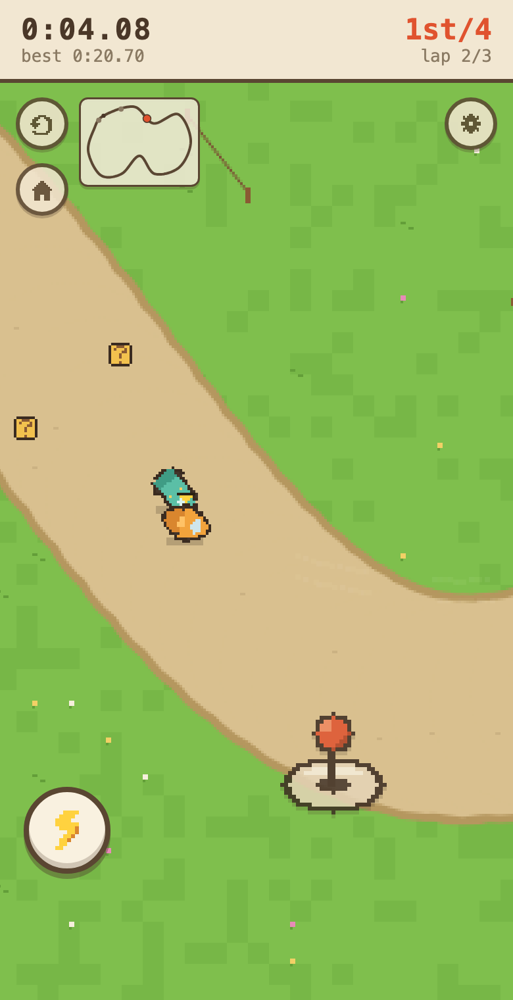

# vroom

A cute pixel-art racing game for your thumb. Drag sideways to steer, hold to
go, drift the corners, beat your best lap.

**Play it: [vroom-cyan-ten.vercel.app](https://vroom-cyan-ten.vercel.app)** —
one thumb, best on a phone.

| | | |
|---|---|---|
|  |  |  |

Six car archetypes with genuinely different handling (plus a custom one you
tune yourself), five cups to unlock, group races against a rubber-banding AI
field or solo time trials against your own ghosts, and a marshal who will call
a cut if the grass carries you to another ribbon of road.

TypeScript + Vite PWA, no framework. Deploys statically (Vercel auto-detects
Vite; `npm run build` → `dist/`).

## Run it

```
npm install
npm run dev
```

Desktop controls: arrows / WASD. Mobile: one thumb — hold to throttle, and
drag so the stick points where you want to go on screen; the car steers
itself toward that direction.

## Tuning the feel

Tap the ⚙ button in-game for live sliders over every physics/camera/steering
lever. Values persist locally; "copy json" exports them for pasting back into
`DEFAULT_TUNING` (`src/game/tuning.ts`).

## Test

```
npm test
```
